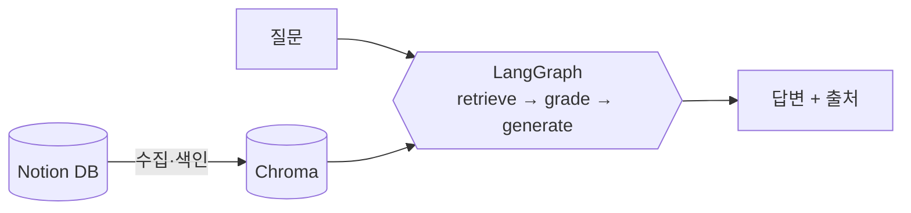

# 📚 RAG Agent with Notion DB

**Notion 데이터베이스를 지식 소스로 사용하는 RAG 에이전트** — RAG와 LangGraph 학습을 위한 스터디 프로젝트입니다.

질문을 하면 Notion 문서에서 관련 내용을 검색하고, 검색 품질이 나쁘면 **스스로 쿼리를 재작성해 재검색**한 뒤(self-corrective RAG), 출처와 함께 답변합니다.



## 기술 스택

| 구성 요소 | 선택 |
|---|---|
| 오케스트레이션 | LangGraph (self-corrective RAG 그래프) |
| LLM / 임베딩 | OpenAI `gpt-4o-mini` / `text-embedding-3-small` |
| 벡터 스토어 | Chroma (로컬 persist) |
| 지식 소스 | Notion API (`notion-client`) |
| UI | Streamlit 채팅 |

## 빠른 시작

### 1. 설치

```powershell
git clone https://github.com/coldclosewin-design/rag-agent-notion-db.git
cd rag-agent-notion-db
python -m venv .venv
.\.venv\Scripts\Activate.ps1
pip install -r requirements.txt
```

### 2. 환경 변수

```powershell
Copy-Item .env.example .env
```

`.env`에 최소한 `OPENAI_API_KEY`를 설정합니다. (Notion 연동은 아래 4단계에서)

### 3. 샘플 문서로 먼저 돌려보기 (Notion 불필요)

```powershell
python scripts/ingest.py --sample   # sample_docs/ 색인
streamlit run app.py                # 브라우저에서 질문
```

> 💡 **명령어는 항상 프로젝트 폴더에서 + 가상환경 활성화 후** 실행해야 합니다:
> ```powershell
> cd C:\Project\11_rag-agent-notion-db   # (본인의 클론 경로)
> .\.venv\Scripts\Activate.ps1           # 프롬프트에 (.venv)가 붙으면 성공
> ```
> 터미널 없이 쓰려면 **`run_app.bat`(앱 실행) / `run_ingest.bat`(재수집)을 더블클릭**하면 됩니다.

"RAG가 뭐야?", "LangGraph의 조건부 엣지란?" 같은 질문을 던져보세요.

### 4. 실제 Notion DB 연결

1. **[docs/00-notion-setup.md](docs/00-notion-setup.md)** 를 따라 Integration 생성 → DB 연결 → `.env`에 `NOTION_TOKEN`, `NOTION_DATABASE_ID` 설정
2. 수집 & 색인:
   ```powershell
   python scripts/ingest.py
   ```
3. `streamlit run app.py` 로 내 Notion 문서에 질문!

## 프로젝트 구조

```
├── app.py                     # Streamlit 채팅 UI
├── scripts/
│   ├── ingest.py              # 색인 구축 CLI (--sample: 오프라인 모드)
│   └── draw_graph.py          # 그래프 Mermaid 다이어그램 자동 생성
├── src/rag_agent/
│   ├── config.py              # 모든 설정의 단일 출처
│   ├── notion_loader.py       # Notion DB → Markdown
│   ├── ingest.py              # 청킹 → 임베딩 → Chroma
│   ├── retriever.py           # 색인 로드 + retriever
│   ├── graph.py               # ⭐ LangGraph State/노드/엣지
│   └── prompts.py             # 노드별 프롬프트
├── sample_docs/               # 오프라인 테스트용 샘플 문서
├── tests/test_smoke.py        # API 미호출 스모크 테스트
└── docs/                      # 📖 스터디 문서 (아래)
```

## 📖 스터디 문서

구현 과정과 설계 의도를 단계별로 정리했습니다. 순서대로 읽는 것을 권장합니다.

> 🖼️ **한 장 요약 리포트**: [docs/report.html](docs/report.html) — 아키텍처·그래프 흐름도·검증 결과·트러블슈팅 타임라인을 시각화한 HTML 리포트입니다.
> GitHub에서는 HTML이 소스로만 보이므로, ① 로컬에서 파일을 브라우저로 열거나 ② 저장소 Settings → Pages를 켜면(`main` 브랜치 `/docs` 폴더) `https://coldclosewin-design.github.io/rag-agent-notion-db/report.html` 에서 렌더링된 화면을 볼 수 있습니다.

| 문서 | 내용 |
|---|---|
| [00-notion-setup.md](docs/00-notion-setup.md) | Notion Integration 생성부터 DB ID 확인까지 셋업 가이드 |
| [01-architecture.md](docs/01-architecture.md) | 전체 아키텍처 — 수집/질의 흐름 분리와 기술 선택 이유 |
| [02-ingestion.md](docs/02-ingestion.md) | 수집 파이프라인 — Notion 블록 파싱, 청킹 전략, 색인 |
| [03-langgraph.md](docs/03-langgraph.md) | ⭐ 그래프 설계 — State, 노드, 조건부 엣지, self-corrective 루프 |
| [04-streamlit.md](docs/04-streamlit.md) | UI — 캐싱, 세션 상태, RAG 내부 동작 시각화 |

## 그래프 동작 (핵심)

```
START → retrieve → grade_documents ──관련 문서 있음──→ generate → END
                        │
                        ├─없음 & 재시도 가능→ rewrite_query → retrieve (루프)
                        └─재시도 소진──────→ generate ("찾지 못했습니다" 안내)
```

- **grade_documents**: LLM이 검색 결과의 관련성을 재평가해 무관한 문서를 필터링
- **rewrite_query**: 검색 실패 시 쿼리를 재작성해 재검색 (최대 2회)
- 자세한 설계 근거는 [docs/03-langgraph.md](docs/03-langgraph.md)

## 테스트

```powershell
python -m pytest tests/ -v          # API 호출 없는 스모크 테스트
python scripts/draw_graph.py        # 그래프 다이어그램 재생성
```

## 설정 변경

모델, 청크 크기, top-k, 재시도 횟수 등은 모두 [src/rag_agent/config.py](src/rag_agent/config.py) 한 곳에서 조정할 수 있습니다. 값을 바꿔가며 검색 품질 변화를 관찰하는 것도 좋은 실험입니다.
