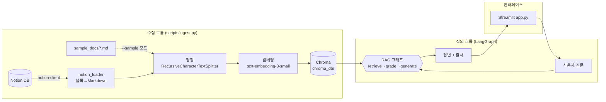

# 01. 전체 아키텍처

## 시스템 개요

이 프로젝트는 두 개의 독립된 흐름으로 구성됩니다.

1. **수집 흐름 (오프라인, 가끔 실행)** — Notion 문서를 벡터 색인으로 변환
2. **질의 흐름 (온라인, 질문마다 실행)** — LangGraph가 색인을 검색하여 답변 생성

## 왜 수집과 질의를 분리했는가

- 임베딩은 비용과 시간이 드는 작업입니다. 문서가 바뀔 때만 다시 실행하면 됩니다.
- 질의 시점에는 이미 만들어진 색인을 읽기만 하므로 응답이 빠릅니다.
- 분리 덕분에 `--sample` 모드로 Notion 없이도 질의 흐름 전체를 개발/테스트할 수 있었습니다.

## 모듈 구성

| 모듈 | 책임 | 스터디 문서 |
|---|---|---|
| `src/rag_agent/config.py` | 모든 설정(모델, 청크 크기, 경로)의 단일 출처 | — |
| `src/rag_agent/notion_loader.py` | Notion API → Markdown 텍스트 | [02-ingestion.md](02-ingestion.md) |
| `src/rag_agent/ingest.py` | 청킹 → 임베딩 → Chroma 저장 | [02-ingestion.md](02-ingestion.md) |
| `src/rag_agent/retriever.py` | 저장된 색인 로드, retriever 제공 | [02-ingestion.md](02-ingestion.md) |
| `src/rag_agent/graph.py` | LangGraph State/노드/엣지 정의 | [03-langgraph.md](03-langgraph.md) |
| `src/rag_agent/prompts.py` | 노드별 프롬프트 (로직과 분리) | [03-langgraph.md](03-langgraph.md) |
| `app.py` | Streamlit 채팅 UI | [04-streamlit.md](04-streamlit.md) |

## 기술 선택과 이유

| 선택 | 이유 |
|---|---|
| **LangGraph** | 조건 분기·루프가 있는 에이전트 흐름을 선언적으로 표현 + 자동 시각화 |
| **OpenAI (gpt-4o-mini)** | LLM과 임베딩을 API 키 하나로 해결, 스터디용으로 저렴 |
| **Chroma** | 서버 설치 없이 로컬 파일로 동작하는 벡터 스토어 |
| **Streamlit** | 파이썬만으로 채팅 UI 구현, RAG 내부 동작(검색 결과) 노출이 쉬움 |
| **notion-client** | Notion 공식 SDK |
