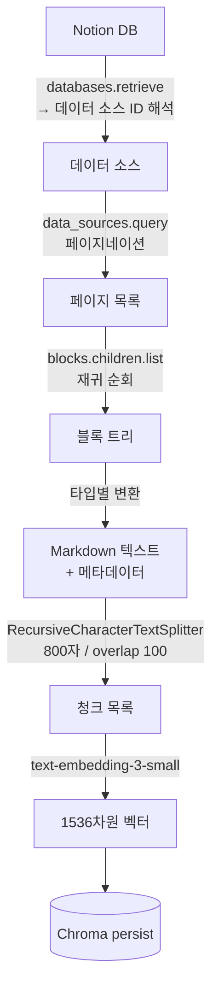

# 02. 수집(Ingestion) 파이프라인

`문서 → 텍스트 → 청크 → 벡터 → 색인` 으로 이어지는 RAG의 전처리 단계입니다.



## 1. Notion → Markdown (`notion_loader.py`)

Notion 페이지 본문은 **블록 트리**입니다. 문단, 제목, 리스트, 코드가 모두 블록이고
블록 안에 자식 블록이 중첩될 수 있습니다. 구현 포인트:

- **데이터 소스 해석**: Notion API 2025-09-03부터 데이터베이스는 하나 이상의
  **데이터 소스(data source)** 를 가지며 페이지 조회는 소스 단위로 합니다.
  URL에서 얻는 ID는 데이터베이스 ID이므로 `databases.retrieve`로 소스 ID를 먼저 얻고
  `data_sources.query`로 페이지를 조회합니다 (notion-client 3.x 기준).
- **페이지네이션**: `data_sources.query`와 `blocks.children.list` 모두 한 번에 최대 100개만
  반환하므로 `has_more` / `next_cursor` 루프가 필수입니다.
- **rich_text 병합**: 블록의 텍스트는 서식 단위로 조각나 있어(`rich_text` 배열)
  `plain_text`를 이어 붙여야 온전한 문장이 됩니다.
- **재귀 순회**: `has_children`이 true인 블록은 자식을 재귀 조회합니다. 들여쓰기로 계층 표현.
- **Markdown 변환 이유**: heading을 `#`으로 남겨두면 청킹 시 문단 경계 힌트가 되고,
  LLM도 구조를 이해하기 쉽습니다.
- **속성(properties)도 추출**: 실제 개발 중 발견한 함정 — 명언집·단어장 같은 DB는
  내용이 페이지 **본문이 아니라 속성(컬럼)** 에 들어 있는 경우가 많습니다.
  본문만 가져오면 제목뿐인 빈 문서가 되어 검색해도 답할 내용이 없습니다.
  그래서 rich_text, select, date 등 속성을 `- 속성명: 값` 형태로 텍스트에 포함합니다.
- **메타데이터 보존**: 페이지 제목·URL·수정일을 `Document.metadata`에 담아
  답변의 **출처 표시**에 사용합니다.

## 2. 청킹 (`ingest.py`)

```python
RecursiveCharacterTextSplitter(
    chunk_size=800, chunk_overlap=100,
    separators=["\n\n", "\n", " ", ""],
)
```

- **왜 800자?** 한 청크가 하나의 주제를 담을 만큼 크고, 무관한 내용이 섞이지 않을 만큼 작은
  절충점. 정답은 없으며 `config.py`에서 바꿔가며 실험하는 것이 스터디 포인트입니다.
- **왜 overlap 100?** 청크 경계에서 문장이 잘려 문맥을 잃는 것을 완화합니다.
- **Recursive의 의미**: 문단(`\n\n`) 경계에서 먼저 자르고, 안 되면 줄, 단어 순으로
  점점 작은 단위로 내려가며 자연스러운 경계를 최대한 지킵니다.

## 3. 임베딩 & 색인

- `Chroma.from_documents(...)` 한 번의 호출로 임베딩 API 호출과 저장이 함께 처리됩니다.
- `persist_directory`를 지정했으므로 디스크(`chroma_db/`)에 저장되어 재시작 후에도 유지됩니다.
- **멱등성**: 재수집 시 기존 색인 폴더를 지우고 다시 만듭니다. 증분 색인(변경된 페이지만
  갱신)은 `last_edited_time` 메타데이터를 활용한 심화 과제로 남겨두었습니다.

## 4. 샘플 모드 (`--sample`)

Notion 토큰이 없어도 `sample_docs/*.md`로 같은 파이프라인을 태울 수 있습니다.

```powershell
python scripts/ingest.py --sample
```

외부 의존성(Notion)과 핵심 로직(청킹·임베딩·색인)을 분리하면
개발 속도와 테스트 용이성이 크게 좋아진다는 것을 보여주는 설계입니다.
