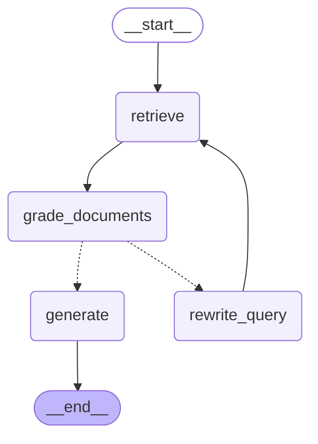

# 03. LangGraph 그래프 설계

이 프로젝트의 핵심 스터디 대상입니다. 단순한 `retrieve → generate` 체인 대신
**self-corrective RAG**(스스로 검색을 교정하는 RAG)를 그래프로 구현했습니다.

## 그래프 구조

`scripts/draw_graph.py`가 LangGraph에서 자동 생성한 다이어그램:



(점선 = 조건부 엣지, 실선 = 고정 엣지)

## 왜 이 구조인가

단순 RAG의 약점: **검색이 실패하면 답변도 실패**합니다. 사용자의 질문 표현이
문서의 표현과 다르면(어휘 불일치) 유사도 검색이 엉뚱한 문서를 가져오고,
LLM은 무관한 컨텍스트로 환각성 답변을 만들 수 있습니다.

이를 보완하는 두 장치:

1. **grade_documents** — 검색 결과를 그대로 믿지 않고 LLM이 관련성을 재평가하여
   무관한 문서를 걸러냅니다.
2. **rewrite_query 루프** — 관련 문서가 하나도 안 남으면 검색 쿼리를 재작성해
   다시 검색합니다(최대 2회). 그래도 없으면 솔직하게 "못 찾았다"고 답합니다.

## State 설계

```python
class GraphState(TypedDict):
    question: str               # 사용자의 원래 질문 (불변 - 평가/생성의 기준)
    query: str                  # 현재 검색 쿼리 (rewrite마다 갱신)
    documents: list[Document]   # 관련성 평가를 통과한 문서
    generation: str             # 최종 답변
    retry_count: int            # 재작성 횟수 (무한 루프 방지)
```

설계 포인트:

- **question과 query를 분리**한 이유 — 재작성은 "검색용 쿼리"만 바꿔야 하며,
  관련성 평가와 답변 생성은 항상 **원래 질문** 기준이어야 합니다.
- **retry_count** — 루프가 있는 그래프에는 반드시 종료 조건이 필요합니다.
  없으면 검색이 계속 실패할 때 무한 루프에 빠집니다.
- 각 노드는 State 전체가 아니라 **변경할 필드만 담은 dict를 반환**합니다.
  LangGraph가 이를 기존 State에 병합합니다.

## 노드별 해설

### retrieve
`query`(비어 있으면 `question`)로 Chroma에서 top-k 검색. 순수 검색만 담당.

### grade_documents
문서마다 LLM에게 "이 문서가 질문과 관련 있는가?"를 yes/no로 묻습니다.

- **structured output** (`with_structured_output(RelevanceGrade)`) 사용:
  LLM 응답을 자유 텍스트로 받으면 파싱이 불안정하므로, Pydantic 스키마로
  `binary_score: Literal["yes", "no"]`를 강제합니다.
- 채점 기준은 관대하게("명백히 무관한 것만 걸러라") — 지나치게 엄격하면
  유용한 문서까지 버려서 recall이 떨어집니다.

### rewrite_query
검색 실패 시 원래 질문의 의도를 유지하며 키워드 중심 쿼리로 재작성.
`retry_count`를 증가시켜 종료 조건에 반영합니다.

### generate
관련 문서를 `[제목]\n내용` 형태로 이어 붙여 컨텍스트로 제공하고,
"컨텍스트에 근거해서만 답하라 + 출처를 명시하라"는 시스템 프롬프트로 답변 생성.
문서가 없으면 LLM을 호출하지 않고 고정 안내 문구를 반환합니다(비용 절약 + 환각 원천 차단).

## 조건부 엣지

```python
def decide_after_grading(state) -> Literal["generate", "rewrite_query"]:
    if state["documents"]:                              # 관련 문서 있음
        return "generate"
    if state["retry_count"] < config.MAX_QUERY_REWRITES:  # 재시도 여유 있음
        return "rewrite_query"
    return "generate"                                   # 재시도 소진 → 안내 답변
```

조건부 엣지 함수는 **State를 읽어 다음 노드 이름을 반환**하기만 합니다.
로직(어디로 갈지)과 작업(무엇을 할지)이 분리되어 그래프가 읽기 쉬워집니다.

## 실행 흐름 예시

**정상 케이스** — "RAG가 뭐야?"
```
retrieve(4개 검색) → grade(4개 통과) → generate → END
```

**교정 케이스** — 어휘가 문서와 안 맞는 질문
```
retrieve → grade(0개 통과) → rewrite_query(재작성) → retrieve → grade(2개 통과) → generate → END
```

**실패 케이스** — 색인에 없는 주제
```
retrieve → grade(0개) → rewrite → retrieve → grade(0개) → rewrite → retrieve → grade(0개)
→ generate("찾지 못했습니다" 안내) → END
```

## 심화 과제 아이디어

- `generate` 뒤에 **답변 품질 평가 노드**를 추가해 환각 검증 (CRAG/Self-RAG 패턴)
- 대화 히스토리를 State에 추가해 멀티턴 질문 지원 (`MemorySaver` 체크포인터)
- `grade_documents`의 문서별 평가를 병렬화 (`Send` API)
