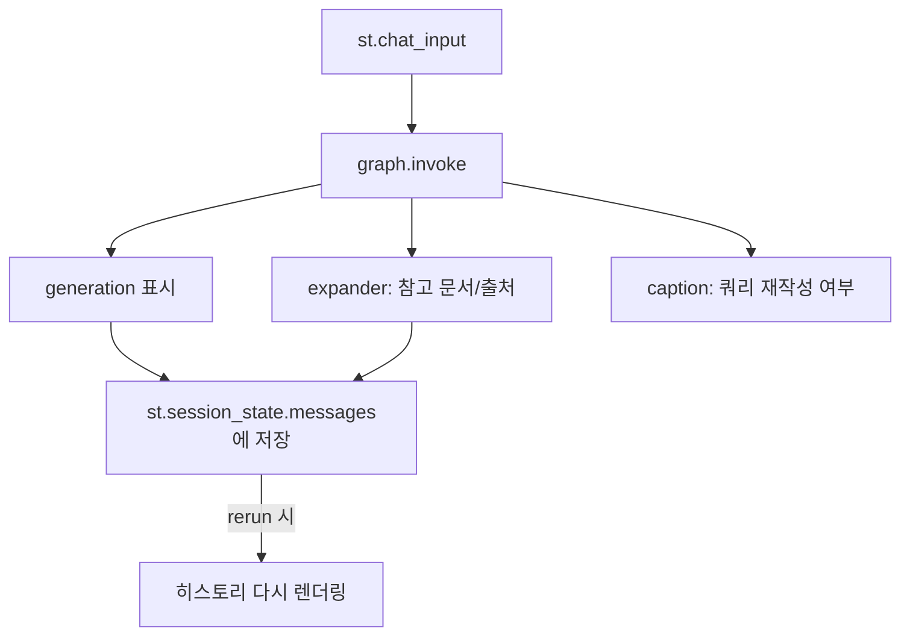

# 04. Streamlit 채팅 UI

`app.py`는 RAG 그래프를 브라우저에서 대화형으로 테스트하는 얇은 UI 레이어입니다.
핵심 로직은 전부 `src/rag_agent/`에 있고, UI는 그래프를 호출해 결과를 보여주기만 합니다.

## 구조



## 구현 포인트

### `@st.cache_resource`로 그래프 1회 컴파일

Streamlit은 사용자 입력이 있을 때마다 **스크립트 전체를 다시 실행**합니다.
매번 그래프를 다시 compile하면 낭비이므로 `@st.cache_resource`로 캐싱합니다.

```python
@st.cache_resource
def get_graph():
    return build_graph()
```

### `st.session_state`로 대화 히스토리 유지

재실행 사이에 살아남는 저장소는 `st.session_state`뿐입니다.
`messages` 리스트에 `{role, content, sources}`를 쌓고, 재실행 때마다 다시 그립니다.

> 참고: 현재 히스토리는 **화면 표시용**입니다. 그래프는 매 질문을 독립적으로 처리합니다.
> 멀티턴 문맥 유지는 LangGraph 체크포인터를 쓰는 심화 과제입니다 (docs/03 참고).

### RAG 내부를 노출하는 UI (스터디 포인트)

답변만 보여주면 RAG가 잘 동작하는지 알 수 없습니다. 그래서:

- **참고한 문서 expander** — `result["documents"]`의 제목과 본문 미리보기를 표시.
  검색이 어떤 근거를 가져왔는지 눈으로 확인할 수 있습니다.
- **쿼리 재작성 caption** — `retry_count > 0`이면 self-corrective 루프가 실제로
  작동했음을 표시합니다. "관련 없는 질문"을 던져보면 이 경로를 관찰할 수 있습니다.
- **사이드바** — 색인 존재 여부, 사용 중인 모델/설정 표시.

## 실행

```powershell
# 사전 조건: 색인 구축
python scripts/ingest.py --sample   # 또는 Notion 모드

streamlit run app.py
```

브라우저에서 http://localhost:8501 이 열립니다.

## 테스트 시나리오

| 질문 | 기대 동작 |
|---|---|
| "RAG가 뭐야?" | 정상 검색 → 출처와 함께 답변 |
| "청킹 크기는 왜 중요해?" | 관련 청크 검색 → 근거 기반 답변 |
| "오늘 저녁 메뉴 추천해줘" | grade에서 전부 탈락 → rewrite 루프 → "찾지 못했습니다" 안내 |
